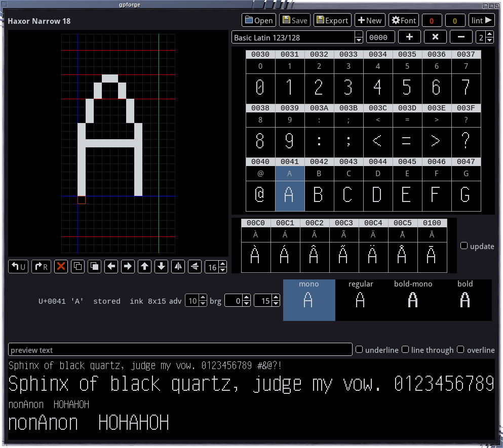

# gpforge

A bitmap font editor for [gfxprim](http://gfxprim.ucw.cz).



## Supported formats

- Export to BDF
- Export to gfxprim C compiled-in font

A native font is a **directory of text files** — family metadata, and one file
per style variant that stores only what it changes. The format is described in
[FONT\_FORMAT.md](FONT_FORMAT.md).

## Design choices

**Four variants, one drawing.** `mono`, `regular`, `bold-mono` and `bold` are
one family: each is a diff against its parent, bold is derived by emboldening,
and a glyph is drawn once and reused by every variant that does not need its
own. The strip under the canvas shows all four live, and clicking one
switches to it.

**Editing.** Pixels with the mouse or the keyboard, shift and flip, the
advance and both bearings on spin buttons. A glyph can be started as a copy
of another, `¿` is `?` pasted and flipped both ways. The canvas shows the baseline, the
ascent and descent, the origin and the advance, because a bitmap glyph is
metrics as much as ink. Editing an inherited glyph creates the overlay; `v`
deletes it again and the glyph goes back to what the lattice derives.

**Undo** is one journal for the whole family, one entry per stroke or command,
and a command that touches many glyphs is taken back in one go.

**Glyph table** paged by unicode block, with the coverage of each block, the
codepoint over every cell, and the character as another font draws it for
comparison. Blocks the font has no glyphs in yet can be declared so an empty
font remembers what it is aiming at.

**Accented letters are drawings, not compositions.** A strip shows every
accented form of the letter being edited; ticking *update* copies each edit
into all of them, and clicking an empty slot draws that letter once from the
base and the accent. Selecting a combining mark instead lists the letters
that wear it, composed with the mark as it is being drawn.

**Preview** through gfxprim itself — the variant is compiled into a real
`gp_font_face`, so what is on the screen is what an application will render.
A sample per unicode block, the selected glyph between reference glyphs for
judging spacing, and a line to type whatever you want to look at. Check boxes
draw the font's underline, strikethrough and overline over it, each at the
size its line is drawn at.

**Lint** for what cannot be seen one glyph at a time: ink outside a monospace
cell, an advance that does not match the variant, an accent above the ascent,
an x-height letter that does not reach the x-height. One key walks to the
next finding, wrapping, recomputed every time.

**Font properties** in one dialog: the family name, the line box, em, x-height,
cap height, digit width and the three rules. The metrics the importer
measures can be measured again off the variant being edited, and the whole
change is one undo. With no font open the same dialog starts a new one.

**Import and export.** BDF in (including iso8859-2 fonts, mapped to unicode),
and out to BDF again or to a gfxprim C compiled-in font.

## Build

```bash
make                  # gpforge and gpforge-cli
make test             # the unit tests and the corpus round trips
make lint             # the checks over the corpus
make install          # binaries, the layout and the desktop entry
```

`make install` honours `DESTDIR`, and `gpforge.spec` builds an RPM from it.
The editor reads its layout from `/etc/gp_apps/gpforge/layout.json`, or from
`./layout.json` when run from the source tree.

The corpus tests run over the
[terminal bitmap fonts](https://github.com/metan-ucw/fonts),
expected in `../fonts` (override with `FONTS=`), and skip when it is not there.

## Run

```bash
gpforge font.bdf        # a BDF, imported
gpforge font-dir/       # a font directory
gpforge                 # nothing open, use open or new
```

On the canvas:

| | |
|---|---|
| mouse | toggle a pixel, drag to continue |
| space | toggle the pixel under the cursor |
| arrows | move the pixel cursor, with alt by five |
| shift+arrows | shift the ink, which is a bearing edit |

On the glyph table:

| | |
|---|---|
| click | select a glyph |
| arrows | move the selection |
| wheel, PgUp / PgDn | a page of the block |

On the accented letters strip:

| | |
|---|---|
| click | select it, or draw it when the slot is empty |
| wheel | scroll the list by a cell |

Anywhere:

| | |
|---|---|
| `[` `]` | advance |
| `x` `y` | flip horizontally / vertically |
| Del | clear the glyph |
| `v` | revert to inherited / derived |
| `l` | next lint finding |
| Ctrl+C / Ctrl+V | copy the glyph / paste it over the selected one |
| Ctrl+Z / Ctrl+Shift+Z | undo / redo |
| Ctrl+O / N / S | open / new / save |
| Ctrl+P | font properties |
| Ctrl+Q | quit |

The variant is the strip under the canvas, and the block is the spin button
over the table with the codepoint field beside it — both are clicked, not
typed at.

## Command line

```bash
gpforge-cli import <font.bdf> <dir>                 # BDF -> a font directory
gpforge-cli write  <dir> <out-dir>                  # rewrite a directory
gpforge-cli dump   <font.bdf|dir>                   # the model, as text
gpforge-cli face   <font.bdf|dir> <variant>         # one resolved face
gpforge-cli lint   <font.bdf|dir>                   # the checks
gpforge-cli c      <font.bdf|dir> <id> <name>       # a gfxprim C font
gpforge-cli bdf    <font.bdf|dir> <variant>         # one variant as BDF
```

`face` is the quickest way to see what the variant lattice actually produces:
every glyph with its provenance, its metrics and its ink.

## Licence

GPL-2.0-or-later.
